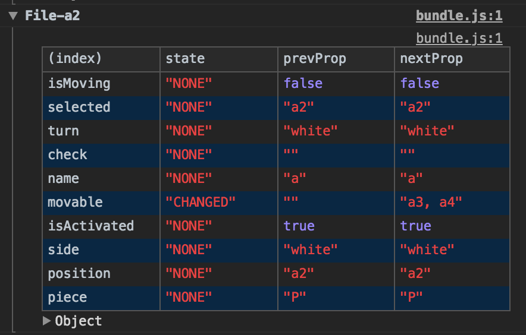

# scu-inspector

[](https://www.npmjs.com/package/scu-inspector) [](https://www.npmjs.com/package/scu-inspector)
[](https://travis-ci.org/jsveron23/scu-inspector)

Please, write [issue](https://github.com/jsveron23/scu-inspector/issues) or PR, if have any feedback.

It does not display after filtered by false in SCU. So you can just check what props were not apply by filtered.

## Synopsis

I used to display by using console.log to check prop changes in Console tab. But it was hard to recognize what was changed or not. So, I implemented module to check as table view in Console tab to avoid annoying.

Purpose is displaying props changes of shouldComponentUpdate(React). It is designed to use by single component by using decorator. If you want to apply every React components by using just once, use '[why-did-you-update](https://github.com/maicki/why-did-you-update)'.

## Installation

```bash
npm install --save scu-inspector
```

## Screenshot



## Usage

**Babel**

```JSON
"plugins": [
  "transform-decorators-legacy"
]
```

**Javascript (React)**

```javascript
import scuInspector from 'scu-inspector'

// with options
@scuInspector({
  // [optional] display props changes
  mode: 'changed', // all(default), changed, none

  // [optional] default display name will be using component name
  // but if you want to use unique string to recognize among components
  uniqueKey: 'position', // key name of props

  // [optional] it displays in Development Tool as console.table
  // default is false
  isCollapsed: true,

  // [optional]
  // logs off in production by default
  // but you can turn it off or not manually
  // default is true
  debug: false,

  // [optional] show specific keys of props
  // ignoring exclude
  include: ['name', 'homepage'],

  // [optional] hide specific keys of props
  exclude: ['age', 'address', 'location']
})
shouldComponentUpdate (nextProps) {
  ...
}

// without options
@scuInspector()
shouldComponentUpdate (nextProps) {
  ...
}
```

## License

[MIT](LICENSE.md)
